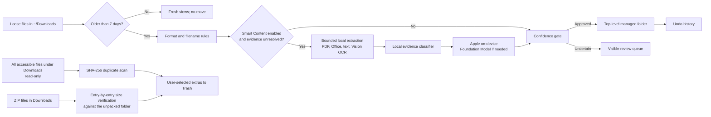

# FileMorrow

<p align="center">
  
  <br><br>
  <a href="https://github.com/M-Nabeegh/FileMorrow/releases/latest">
    
  </a>
</p>

<p align="center">
  <strong>Organize your Downloads with on-device Apple Intelligence—guided by your own rules.</strong>
  <br>
  Private, reversible, and made for macOS by Nabeegh.
</p>

<p align="center">
  <a href="https://github.com/M-Nabeegh/FileMorrow/actions/workflows/ci.yml"></a>
  <a href="https://github.com/M-Nabeegh/FileMorrow/releases/latest"></a>
  
</p>

<p align="center">
  
</p>

FileMorrow keeps fresh files in **Today**, **Yesterday**, and **Last 7
Days** views. Only older loose files become eligible for category folders.
Downloaded folders are never moved or reorganized, and every organization
batch can be undone.

| | Format mode | Smart Content mode |
|---|---|---|
| Default | **Yes** | Opt-in |
| Classification | Known extension and system file type | Filename, local extracted evidence, then Apple Foundation Models when needed |
| Apple Intelligence required | No | Yes, for unresolved content |
| Predictability | Highest | More meaningful subject folders, but suggestions can be wrong |
| Privacy | Local | Local, using Apple's on-device model |
| Best for | Automatic low-maintenance cleanup | Mixed-subject University, Finance, Medical, Legal, and Work documents |

> **Format mode is the recommended default.** Smart Content is useful when
> subject matters more than extension, but the model is not perfectly accurate.
> FileMorrow therefore uses deterministic evidence first and leaves uncertain
> items visible for review.

## Highlights

- On-device classification with Apple Foundation Models
- Predictable **By File Format** mode with no AI queue
- Optional **Smart Content** mode using metadata, extracted content, and Apple Intelligence
- Fast local evidence scoring before invoking the language model
- Content extraction for PDF, DOCX, PPTX, XLSX, ZIP, text, code, and images
- Local OCR with Vision
- Persistent AI decisions and user corrections
- Quick Look file previews and one-click opening in the file’s default app
- A **Teach Organizer** workflow for corrections, filename rules, format rules,
  and reusable on-device model examples
- Separate Awaiting Analysis and Needs Review states
- Analyze-next and continuous Analyze All modes with a Stop control
- Editable, importable, and exportable organization profiles
- User-selectable and fully custom categories
- Confidence-gated organization
- Plan-first approval before any eligible file moves
- Explicit **Undo Last Organization**, Command-Z, and collision-safe moves
- Progress-aware, cancellable exact duplicate detection with SHA-256 and recoverable Trash cleanup
- Choose which copy of a duplicate group to keep before anything is removed
- **Extracted Archives**: reclaim space from ZIP files you already unpacked
- Top-level-only organization: downloaded folders and their contents are never moved
- Read-only recursive duplicate scanning, with explicit confirmation before Trash
- Color-coded Finder icons distinguish FileMorrow-managed category folders from ordinary folders
- Menu-bar companion for status, rescanning, duplicate checks, and reopening the app
- Optional menu-bar-only mode with a **Keep FileMorrow in the Dock** setting
- Native SwiftUI interface and Settings window
- No analytics, accounts, cloud API keys, or content uploads

## Requirements

- macOS 26 or later
- Apple silicon Mac supported by Apple Intelligence for Smart Content
- Apple Intelligence enabled and its model ready for Smart Content
- Xcode 26 or later to build from source

The app checks Foundation Models availability on launch under **Settings →
Compatibility**. If Apple Intelligence is unavailable, deterministic rules,
file previews, and manual teaching continue to work; only model analysis is
disabled with an explanation. Apple documents the runtime availability states
in [`SystemLanguageModel.Availability`](https://developer.apple.com/documentation/foundationmodels/systemlanguagemodel/availability-swift.enum).

## Build

```bash
swift build -c release
swift test
```

Package a standard ad-hoc-signed macOS application:

```bash
./Scripts/package-app.sh
```

The app is written to `dist/FileMorrow.app`.

Create local ZIP and DMG release artifacts with SHA-256 checksums:

```bash
./Scripts/create-release.sh
```

GitHub release packages are ad-hoc signed and include SHA-256 checksums. They
are not notarized because this independent open-source project does not
currently have an Apple Developer membership.

## Install a GitHub release

1. Download the DMG or ZIP and `SHA256SUMS.txt` from the same release.
2. Verify the checksum with `shasum -a 256 -c SHA256SUMS.txt`.
3. Move FileMorrow to Applications and try to open it once.
4. If macOS blocks it, open **System Settings → Privacy & Security**, scroll to
   **Security**, and choose **Open Anyway**, then authenticate and confirm.

Only override Gatekeeper when the download came from the official FileMorrow
GitHub repository and its SHA-256 checksum matches. Apple notes that software
from an unidentified developer has not been reviewed by Apple, so users should
make this exception only for software they trust. See
[Apple’s Open Anyway instructions](https://support.apple.com/guide/mac-help/mh40616/mac).

## Safety model

FileMorrow defaults to **By File Format** mode: documents, audio, images,
videos, spreadsheets, installers, archives, design files, and code are placed
by known extensions and system file types. This is fast, predictable, and does
not require an analysis queue.

Users can opt into **Smart Content** mode. It considers filename metadata,
extracts a short local evidence sample, and uses Apple's on-device model to
suggest subject folders such as University, Finance, or Medical. These are
suggestions: the model can make mistakes, so important files should be reviewed.
Low-confidence items remain in **Needs Review**. Organization
creates `~/Downloads/<Category>` and records every
move for undo.

FileMorrow persists each top-level file's first-seen date locally. Moving
or undoing a file therefore does not reset the seven-day eligibility window.

The organizer operates only on loose regular files directly inside
`~/Downloads`. Existing, newly created, and newly downloaded folders are always
left in place, and the organizer never moves or modifies their contents. The
duplicate finder can read files recursively to compare exact SHA-256 hashes, but
it never removes anything without explicit confirmation. The same rule applies
to extracted archives: they are found by reading, listed for review, and only
the archive file itself is ever moved to Trash.

## Menu bar

The menu-bar companion remains available when the main window is closed. It can
reopen the app, rescan Downloads, prepare a manual organization plan, check for
duplicates, check for already-unpacked archives, open Settings, or quit. Automatic Organization and Launch at Login
default to on for new installs and are clearly presented during onboarding.
Leaving Automatic Organization enabled grants ongoing consent for hourly
organization without repeated prompts. Only loose files older than the
configured age (seven days by default) are eligible, uncertain files remain
for review, and every completed batch can be undone.

Turn off **Settings → Organization → Keep FileMorrow in the Dock** for a
menu-bar-only experience. The app continues running after its windows close and
can be reopened from the menu-bar companion.

<p align="center">
  
</p>

Choose **Show Welcome Guide** from the FileMorrow app menu, menu-bar companion,
or Settings to reopen onboarding at any time.

## Managed folders

**All Downloads** also presents files directly inside FileMorrow-managed
category folders as a read-only library. Managed folders carry a hidden marker;
arbitrary user/downloaded folders are not displayed or organized. Only the
explicit duplicate scan reads them to compare hashes. Organized files are
labeled and excluded from the seven-day queue so they cannot be moved twice.

<p align="center">
  
</p>

## Extracted archives

Downloads fill up with ZIP files that were unpacked months ago and never
deleted. **Extracted Archives** finds them and offers to move just the archive
to Trash.

An archive is only listed when the evidence is complete:

1. Every file entry in the ZIP exists in the unpacked folder at the same
   relative path.
2. Every one of those files matches the entry's uncompressed size exactly.
3. Bookkeeping macOS discards during extraction (`__MACOSX`, `.DS_Store`,
   AppleDouble `._` files) is ignored, and an entry that would resolve outside
   the destination voids the whole archive.

A partial extraction, a renamed folder, or a single edited file is enough to
leave an archive alone. Both common shapes are recognised: `report.zip`
unpacked to `report/`, and a flat archive unpacked into a folder named after
it.

Nothing is automatic. Results are listed with the unpacked destination, the
verified file count, and the reclaimable size; the user selects what to remove.
Each archive is verified against its unpacked folder one final time at the
moment of deletion, so an archive whose folder was moved or emptied in the
meantime is left in place. **Only the `.zip` file moves to recoverable macOS
Trash. The unpacked folders are never touched.**

## Privacy architecture



There is no server in this path. FileMorrow has no account, analytics SDK,
advertising, cloud API key, or file upload code. Extracted evidence is bounded
and used locally. Network access is needed only when a user downloads the app or
when macOS itself prepares Apple Intelligence.

## First launch

Before automatic organization or Launch at Login registration, onboarding
explains:

1. Files stay loose for seven days.
2. The organizer never moves downloaded folders or anything inside them.
3. Format mode is the predictable default; Smart Content is optional.
4. Organized batches can be undone.
5. Duplicate cleanup uses exact SHA-256 matching and recoverable Trash.
6. Smart Content availability depends on the Mac and Apple Intelligence setup.

## Project structure

- `AppState.swift` — application state and workflows
- `ContentExtractor.swift` — PDF, Office, archive, text, and OCR evidence
- `AIClassifier.swift` — structured on-device classification
- `RuleClassifier.swift` — deterministic and semantic fast path
- `PersistenceStore.swift` — decisions and move history
- `OrganizerService.swift` — collision-safe move and undo
- `DuplicateScanner.swift` — fingerprinted SHA-256 duplicate detection
- `ExtractedArchiveScanner.swift` — verification of already-unpacked archives
- `Views.swift` — native macOS interface
- `Configuration/default-profile.json` — general-purpose format and category catalog

## Custom categories

Open **Settings → Categories** to choose which categories are active, edit their
format and keyword guidance, or add completely new categories. Profiles can be
imported and exported as JSON, making them easy to share or version. See
[`docs/PROFILES.md`](docs/PROFILES.md) for the schema and classification order.

## Preview and teach

Select a file to see its native Quick Look preview. **Open File** launches it in
the user’s default app. **Teach Organizer…** corrects the current file and adds
it as an example for the on-device model. A user can optionally provide a
reusable filename phrase or explicitly map the file extension to that category.
Extension rules are opt-in because broad formats such as PDF and PPTX can cover
many different subjects.

## Privacy

File contents stay on the Mac. The project does not include telemetry,
networking, advertising, or third-party analytics.

Duplicate detection is the one workflow that recursively reads accessible
folders inside Downloads. It hashes bytes locally and never reorganizes nested
content. Nothing is removed automatically: users review each exact-match group,
and confirmed extras go to recoverable macOS Trash. Identical nested project or
app files may be intentional, so the full paths must be reviewed before cleanup.
The organizer itself remains strictly limited to loose top-level files.

## Accuracy and compatibility testing

The suite covers organization and undo, duplicate detection and its refusal
paths, archive verification against real ZIP files built during the test run,
and profile persistence across relaunches.

`SyntheticAccuracyTests` generates privacy-safe fake PDFs, presentations, and
spreadsheets at test time. It verifies local extraction and subject
classification without committing personal documents. Ambiguous filenames and
content must remain uncertain. Compatibility copy is covered for available,
Apple Intelligence disabled, ineligible-device, model-not-ready, checking, and
unknown states.

The packaged-app clean-profile preflight uses a temporary home and empty
settings:

```bash
./Scripts/clean-profile-smoke-test.sh
```

See [`docs/CLEAN_MACHINE_TEST.md`](docs/CLEAN_MACHINE_TEST.md) for the required
second-Mac matrix. A local simulated profile does not replace physical testing
with Apple Intelligence both enabled and disabled.

## License

MIT
